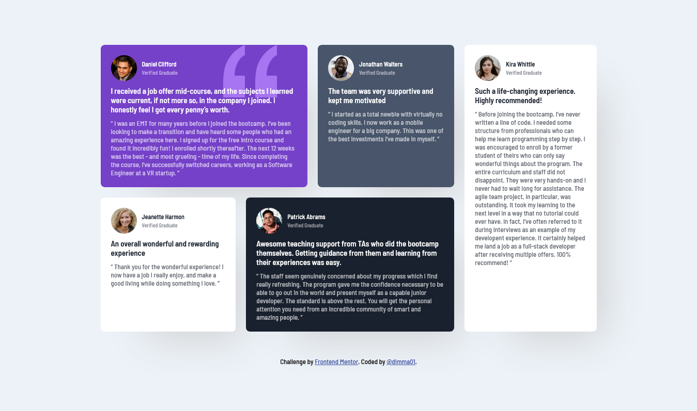

# Frontend Mentor - Testimonials grid section solution

This is a solution to the [Testimonials grid section challenge on Frontend Mentor](https://www.frontendmentor.io/challenges/testimonials-grid-section-Nnw6J7Un7). Frontend Mentor challenges help you improve your coding skills by building realistic projects.

## Table of contents

- [Overview](#overview)
  - [The challenge](#the-challenge)
  - [Screenshot](#screenshot)
  - [Links](#links)
  - [Built with](#built-with)
  - [Useful resources](#useful-resources)
- [Author](#author)

## Overview

### The challenge

Users should be able to:

- View the optimal layout for the site depending on their device's screen size

### Screenshot

### Links

- Solution URL: (https://github.com/dimma01/Frontend-Mentor-Challenges/edit/main/Solution-Frontend-Mentor/Solution-Frontend-Mentor_HTML&CSS/testimonials-grid-section-main)
- Live Site URL: (https://playful-salmiakki-f92d13.netlify.app/)

## My process

### Built with

- Semantic HTML5 markup
- CSS custom properties
- Flexbox
- CSS Grid

### Useful resources

- [Stackoverflow](https://stackoverflow.com/) 

## Author

- Frontend Mentor - [@dimma01](https://www.frontendmentor.io/profile/dimma01)
- GitHub [@dimma01](https://github.com/dimma01)
- Twitter [@sheunemmanuel01](https://twitter.com/sheunemmanuel01?t=ZflkwHgV9IiOzZOAQJsukA&s=09)

